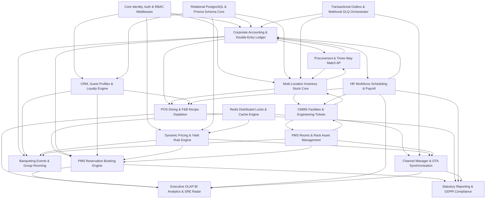

# 07_Module_Dependencies: Master Architecture Dependency Graph Bible

**Document Type:** Master Module Dependency & Coupling Specification (The Dependency Bible)  
**Status:** Approved Specification (Phase 1)  
**Scope:** Strict Directed Acyclic Graph (DAG) boundaries across all 15 operational hotel sub-systems  

---

## 1. Architectural Coupling & Decoupling Mandates

In a large-scale enterprise ERP with over 70 database models, unmanaged cross-module references breed tight coupling, database deadlocks, and cascading regression failures during bug fixes. To protect platform resilience, system integrations must follow strict coupling regulations:

1. **Acyclic Module Hierarchy (No Circular Imports):** Downstream consumer modules may invoke public service routines of upstream producer modules, but upstream Core producer modules (such as Identity, Database Relational Core, or General Ledger) are strictly barred from directly importing or executing code from presentation or downstream domain controllers.
2. **Asynchronous Outbox Decoupling (No Synchronous Cross-Domain Blocking):** High-velocity transactional endpoints (such as POS touchscreens during peak dining service or Front Desk check-in surges) MUST NEVER execute synchronous, blocking multi-table joins or relational table locks against analytical accounting or telemetry reporting schemas.
   - **Right Approach:** A check-in or dining settlement commits its local domain entity and emits an atomic event to the `Outbox` table. Asynchronous daemon workers consume these events to adjust inventory storeroom quantities and balance General Ledger accounts in the background.

---

## 2. Global Enterprise Module Dependency Graph (DAG)

---

## 3. Domain Interconnection Rules & Blast Radius Analysis

When implementing bug fixes or activating dead schemas during subsequent refactoring phases, engineering changes must verify stability against these explicit inter-module dependencies:

### 3.1. Front Office Booking Engine (`SUB_BOOKING`)
- **Upstream Providers (Produces Data to Booking):**
  - `SUB_YIELD` (`YieldRule`, `SeasonalRate`): Evaluates date and occupancy criteria to deliver dynamic nightly pricing calculations.
  - `SUB_ROOMS` (`RoomType`, `Room`): Allocates clean, sellable physical inventory during reservation confirmation and kiosk check-in.
  - `SUB_CRM` (`GuestProfile`, `CorporateAccount`): Binds personal identity preferences and corporate B2B discount contracts.
  - `SUB_REDIS`: Supplies ephemeral distributed concurrency locks (`lock:room_type_hold:*`) preventing simultaneous double-booking during traffic surges.
- **Downstream Consumers (Consumes Data from Booking):**
  - `SUB_ACCOUNTING` (`JournalEntry`, `TransactionCode`): Receives automated double-entry general ledger debit/credit postings for initial reservation deposits, daily room taxes, and final checkout settlements.
  - `SUB_OTA` (`RoomMapping`, `SyncLog`): Consumes booking confirmations via Outbox events to immediately decrement available room inventory counts across external distribution networks (Booking.com, Expedia).
  - `SUB_BI` (`Executive Analytics`): Reads completed stay totals to calculate property RevPAR and occupancy matrix aggregations.

### 3.2. POS Restaurant Dining & F&B Engine (`SUB_POS`)
- **Upstream Providers:**
  - `SUB_INVENTORY` (`InventoryItem`, `InventoryStock`): Sources ingredient recipe dictionaries and validates kitchen physical stock availability during menu item configuration.
  - `SUB_BOOKING` (`Booking`): Verifies active, in-house reservation check-in status and guest identity signatures before authorizing table dining charges to a room folio.
- **Downstream Consumers:**
  - `SUB_INVENTORY` (Via Asynchronous `Outbox` event `POS_ORDER_CLOSED`): Triggers back-office SRE background daemons to execute atomic inventory decrement routines against specific storeroom locations without pausing cashier touchscreens.
  - `SUB_ACCOUNTING`: Emits balanced dining financial records to General Ledger under Revenue account `200-FB-REV` and tax collection liabilities.

### 3.3. Procurement & Three-Way Match Engine (`SUB_PROCURE`)
- **Upstream Providers:**
  - `SUB_INVENTORY` (`InventoryItem`): Selects items requiring supply replenishment when physical storeroom counts dip below minimum designated safety thresholds.
  - `SUB_CORE` (`User`, `Role`): Enforces managerial level weights to validate Purchase Order authorization signatures (e.g., General Manager Level >= 80 for POs exceeding $2,500).
- **Downstream Consumers:**
  - `SUB_INVENTORY` (`GoodsReceipt` -> `InventoryStock`): Executing a loading dock physical goods receipt instantly increments location stock balances and creates immutable tracking entries inside `InventoryMovement`.
  - `SUB_ACCOUNTING` (`VendorInvoice` -> `JournalEntry`): A matched supplier invoice automatically posts double-entry journal vouchers clearing internal GR/IR liability accounts and queuing bank payments.

### 3.4. CMMS Facilities Maintenance & Housekeeping (`SUB_CMMS`)
- **Upstream Providers:**
  - `SUB_ROOMS` (`Room`, `RoomStatusHistory`): Identifies physical accommodation spaces requiring maid cleaning turnover or reactive mechanical engineering repairs.
  - `SUB_INVENTORY` (`InventoryItem`): Supplies replacement spare parts (plumbing fixtures, HVAC filters) withdrawn from mechanical storerooms during work order completion.
- **Downstream Consumers:**
  - `SUB_ROOMS` (`OutOfOrderRecord` -> `Room` status override): A maintenance work order tagged with severe safety flaws automatically forces target room status to `'OUT_OF_ORDER'`, instantly ejecting the key from Front Desk and OTA availability pools.
