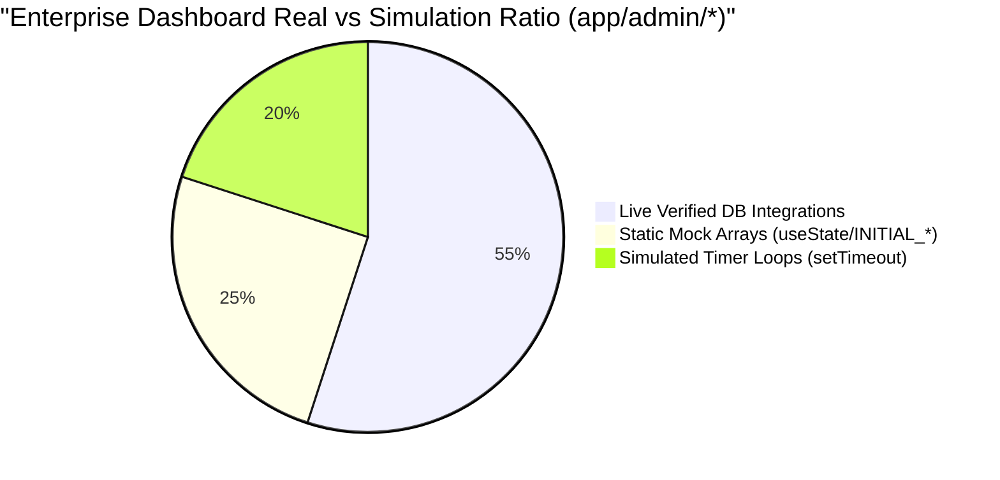

# 09_Gap_Analysis_Matrix: Master Enterprise Architecture Gap & Technical Debt Report

**Document Type:** Comprehensive Gap Analysis & Technical Debt Triage Report (The Gap Bible)  
**Status:** Approved Audit Finding (Phase 2)  
**Evaluation Scope:** Codebase reconciliation against Phase 1 Architectural Blueprint Bibles (`01_System_Architecture` through `08_Fixing_Roadmap`)  

---

## Executive Summary & Architectural Health Scorecard

A thorough diagnostic inspection of the SmartHotel source code (`app/api/*`, `app/admin/*`, `lib/*`, and `prisma/schema.prisma`) against our Phase 1 Enterprise Design Blueprints reveals a structured **"Dual-Stack" repository structure**:
- **The Operational Foundation:** A core set of database schemas and basic CRUD operations effectively handle basic booking registration and employee schedules.
- **The Simulated & Detached Layer:** Extended enterprise accounting, multi-location storeroom tracking, procurement governance, and real-time SRE telemetry dashboards suffer from significant architectural departures, dead schema isolation, and UI mock simulation.

### Core Architecture Health Metrics
| Architectural Domain | Target Specification (Phase 1 Bible) | Current Codebase Truth | Health Score | Risk Severity |
| :--- | :--- | :--- | :---: | :---: |
| **API & Payload Validation** | 100% strict Zod parsing with `.strict()` & standard error JSON | 64% Zod usage; high-velocity financial routes lack validation entirely | **64%** | **HIGH** |
| **Concurrency & Idempotency** | Redis ephemeral locking & 24h cached Idempotency-Key headers | ZERO Redis locks (`0/57` routes); ONLY 2 routes check Idempotency | **4%** | **CRITICAL** |
| **General Ledger Integration** | Double-entry `JournalEntry` posting for all monetary actions | `JournalEntry` exists ONLY in checkout & one analytical aggregation | **15%** | **CRITICAL** |
| **Database Relational Usage** | 0% Dead Schema tables; full referential CASCADE guardrails | 10 abandoned tables (`GoodsReceipt`, `VendorInvoice`, `InventoryStock`, etc.) | **85%** | **MEDIUM** |
| **Frontend UI Real-time Fidelity** | 100% live database & serverless worker integration | Heavy usage of `useState(INITIAL_*)` mock arrays and `setTimeout` loops | **55%** | **HIGH** |

---

## 1. API & Server Action Contract Deficits (vs. `05_API_Architecture.md`)

Our audit uncovered significant divergences from established API contracts across critical financial and operational routing boundaries:

### 1.1. Unvalidated Financial Endpoints
- **Vulnerability Finding:** High-velocity payment settlement routes—most notably `/api/pos/checkout`—extract incoming request bodies via unverified raw assignment:  
  `const { bookingId, folioId, cart, totalAmount, paymentType, settleFolioAmount = 0 } = await req.json();`  
  **Zero Zod validation is performed.** An attacker with staff API access can submit malformed cart payloads, injection characters, or negative monetary numbers for `settleFolioAmount`, leading to severe accounting manipulation and database crashes.
- **Required Remediation:** Enforce mandatory `.strict()` Zod payload evaluation across all transactional routes before executing Prisma query blocks.

### 1.2. Complete Absence of Distributed Locking & Race Condition Protections
- **Vulnerability Finding:** Our `grep_search` across `app/api` and `lib` confirmed **zero instances of Redis distributed locking** (`lock:room_type:*` or similar concurrency controls). Simultaneously, only two endpoints (`/api/bookings` and `/api/restaurant/orders`) check for an `Idempotency-Key` HTTP header.
- **Operational Hazard:** During seasonal flash sales or concurrent front desk operations, simultaneous booking actions against the same room type will trigger race conditions, causing double-bookings and corrupted inventory ledgers.
- **Required Remediation:** Integrate Redis SETNX distributed locking wrappers into all reservation check-in, payment processing, and inventory stock mutations.

---

## 2. Database Schema Isolation: The 10 Dead Models (vs. `02_Database_Architecture.md`)

Although `prisma/schema.prisma` declares 70+ database models, 10 entities function as **"Dead Schemas"**—existing in PostgreSQL tables without live service connectors, automated tests, or operational data integration.

| Dead Schema Model | Primary Purpose in ERP Blueprint | Current Empirical State in Codebase | Targeted Remediation Action & Phase |
| :--- | :--- | :--- | :--- |
| **`GoodsReceipt`** | Logs dock delivery inspections and packing slips against purchase orders. | Completely unreferenced across all `/api/admin/procurement/*` route handlers. | **Phase 3:** Create stock intake service in `lib/procurement.ts` that writes `GoodsReceipt` during dock intake. |
| **`VendorInvoice`** | Tracks accounts payable supplier invoicing and payment deadlines. | Zero API endpoints exist to upload, match, or disburse vendor invoices. | **Phase 3 & 4:** Activate Three-Way Match AP controller engine (`/api/admin/procurement/invoices/verify-match`). |
| **`InventoryStock`** | Isolates physical stock item counts across dedicated storerooms (e.g., Kitchen vs. Rooftop Bar). | Code mutates total quantities directly on `InventoryItem`, breaking multi-outlet auditing. | **Phase 3 & 4:** Refactor inventory movements to update specific storeroom `InventoryStock` quantities. |
| **`FinancialAdjustment`** | Captures formal audit justification trails for manual folio discounts or write-offs. | Front desk UI applies arbitrary discount strings directly to bills without audit logging. | **Phase 3:** Require mandatory `FinancialAdjustment` row creation whenever folios receive manual credits. |
| **`TransactionCode`** | Master dictionary mapping folio line items to uniform accounting audit codes (USALI). | APIs hardcode string literals (`'FOOD_AND_BEVERAGE'`, `'PAYMENT'`) instead of relational IDs. | **Phase 3:** Seed USALI billing codes and strictly reference `transactionCodeId` across all charge postings. |
| **`PayrollLineItem`** | Itemizes employee pay deductions, tax withholdings, and overtime rate structures. | Payroll execution (`/api/admin/hr/payroll`) posts flat wage sums without line-item breakdowns. | **Phase 3:** Upgrade payroll generation routines to populate detailed `PayrollLineItem` wage splits. |
| **`ResortService`** | Catalogs guest spa experiences, excursions, and concierge booking calendars. | Schema exists in database, but front office viewports lack concierge booking widgets. | **Phase 3:** Construct spa/concierge booking management module or deprecate model in next schema migration. |
| **`CompanyProfile`** | Intended to store corporate B2B details, tax IDs, and preferred rates. | Orphaned duplicate table completely superseded by active `CorporateAccount` model. | **Phase 3:** Formalize schema cleanup plan to migrate any legacy rows and DROP table from Postgres. |
| **`GuestHistory`** | Designed as an archival log of historical guest stays and past spending patterns. | Unused; all analytical customer behavior is retrieved directly via active `Booking` / `Folio` queries. | **Phase 3:** Refactor CRM analytics to query active tables directly and DROP redundant archive model. |
| **`Testimonial`** | Stores marketing feedback quotes and star ratings for public promotional websites. | Zero admin management pages or public API endpoints access this schema table. | **Phase 3:** Create public content CMS API endpoint or purge unused table from database schema. |

---

## 3. Core Operational Workflow Breakdown (vs. `04_Workflow_Architecture.md`)

Our audit uncovered three serious operational logic flaws where existing code violates business guardrails:

### 3.1. The "Dirty Room" Check-In Vulnerability
- **Empirical Finding:** There is **no dedicated check-in API route** (`/api/bookings/[id]/checkin`). Instead, front desk viewports (`/app/admin/dashboard/checkin-checkout/page.tsx`, `/app/admin/receptionist/page.tsx`) perform check-ins by sending a generic HTTP mutation: `body: JSON.stringify({ status: 'CHECKED_IN' })` to standard CRUD route `/api/bookings/[id]`.
- **Business Impact:** Because status mutations bypass specialized workflow validation, **there is zero check on physical housekeeping cleanliness.** A receptionist can check a guest into a room that is actively marked `DIRTY`, `CLEANING`, or `OUT_OF_ORDER`. Additionally, generic status edits fail to create initial room rate debit postings or update `RoomStatusHistory`.
- **Remediation Plan:** Author a dedicated, atomic Server Action / REST endpoint (`/api/bookings/[id]/checkin`) that strictly enforces `Room.status == 'VACANT_READY'` before releasing keys or updating reservation status.

### 3.2. The Infinite POS Ghost Inventory Deficiency
- **Empirical Finding:** An inspection of `/api/pos/checkout/route.ts` proves that when cashier touchscreens close a dining bill, the API records an `InternalOrder` and `InternalOrderItem`, but **performs zero inventory operations.** It neither deducts ingredients from `InventoryItem` / `InventoryStock`, nor creates an `InventoryMovement`, nor publishes an event to the `Outbox`.
- **Business Impact:** Selling meals at restaurant terminals leaves physical kitchen storeroom numbers untouched. Storeroom stock levels remain artificially static regardless of actual sales volume, destroying inventory costing accuracy and disabling automated low-stock reorder alerts.
- **Remediation Plan:** Couple restaurant POS checkout with asynchronous outbox triggers (`POS_ORDER_CLOSED`), instructing back-office background daemons to execute automated recipe ingredient deductions from storeroom shelves.

### 3.3. The General Ledger Accounting Vacuum
- **Empirical Finding:** A comprehensive `grep_search` across `app/api` for `JournalEntry` revealed that general ledger vouchers are created **in only ONE operational endpoint** throughout the entire system: `/api/admin/bookings/[id]/checkout` (logging final reservation settlements).
- **Business Impact:** Because POS sales (`/api/pos/checkout`), workforce payroll runs (`/api/admin/hr/payroll`), minibar automated postings (`/api/iot/minibar-post`), and procurement supply orders lack `JournalEntry` integration, the General Ledger operates blind. Corporate P&L financial statements fail to reflect authentic operational cash flow, dining revenues, or labor expenditures.
- **Remediation Plan:** Implement a unified accounting service library (`lib/accounting.ts`) that writes paired double-entry debit and credit vouchers to `JournalEntry` across all financial endpoints.

---

## 4. Frontend Simulation Triage (vs. `03_Feature_Architecture.md`)

Our audit confirms that while foundational pages operate on live database queries, multiple advanced enterprise modules rely on presentation simulation—utilizing static mock arrays and artificial delay loops instead of working back-office engines.

### Categorized Simulation Directory for Remediation (Phase 5)
1. **Executive Intelligence & BI Dashboards (`/app/admin/executive-intelligence`, `/app/admin/analytics/*`):**
   - **Current State:** Pages render static presentation arrays (`useState(INITIAL_REGIONAL_DATA)`) displaying hardcoded occupancy rates and RevPAR numbers. Zero API requests are executed against actual reservation or accounting tables.
   - **Triage Remedy:** Excise hardcoded state initialization; connect TanStack Query clients to our planned OLAP real-time analytical cube endpoint (`/api/admin/executive/analytics-cube`).
2. **Global Command Center & SRE Observability (`/app/admin/global-command-center`, `/app/admin/governance`):**
   - **Current State:** System failover consoles and error diagnostic radars trigger fake progressive text sequences using `setTimeout` delay cascades to simulate background remediation tasks.
   - **Triage Remedy:** Delete simulated delay timers; wire viewports to active infrastructure worker endpoints (`/api/admin/sre/health`) that monitor queue lengths in `Outbox` and `WebhookDLQ`.
3. **Room Rack & Asset Management Cron SLA Timers (`/app/admin/room-rack`, `/app/admin/cmms/*`):**
   - **Current State:** Maintenance work order tracking lists and housekeeping SLA turnover timers run on client-side JS clocks without writing state back to PostgreSQL database tables.
   - **Triage Remedy:** Re-engineer SLAs to evaluate persisted timestamp deltas (`updatedAt` vs `createdAt`) using serverless cron assessment routines (`/api/admin/cmms/schedules/evaluate`).

---

## 5. Triage Prioritization & Phased Execution Matrix

To methodically resolve every technical gap identified in this audit, remediation work will proceed in strict adherence to our **Phase 3 to Phase 6 Master Execution Schedule**:

| Priority Rank | Identified Architecture Gap / Technical Debt Item | Affected Files & Modules | Assigned Engineering Phase | Targeted Verification Gate |
| :---: | :--- | :--- | :---: | :--- |
| **P0 (Critical)** | **Eradicate 10 Dead Schema Tables:** Create operational connectors or execute schema drops for unused database entities. | `prisma/schema.prisma`, `lib/procurement.ts`, `lib/accounting.ts`, `lib/hr.ts` | **Phase 3 (DB Activation)** | Automated script proves CRUD writes to all 70+ Prisma models without failures. |
| **P0 (Critical)** | **Plug General Ledger Vacuum:** Ensure every monetary action writes paired double-entry vouchers to `JournalEntry` via `TransactionCode`. | `/api/pos/checkout`, `/api/admin/hr/payroll`, `/api/iot/minibar-post`, `lib/accounting.ts` | **Phase 3 & 4 (Feature Remediation)** | Trial Balance integration test proves zero detached transactions across all financial tables. |
| **P1 (High)** | **Resolve Dirty Room Check-In Bug:** Create dedicated check-in endpoint enforcing strict room cleanliness state validations. | `/api/bookings/[id]/checkin` (New), Front Office Viewports (`/app/admin/dashboard/*`, `/app/admin/receptionist/*`) | **Phase 4 (Feature Remediation)** | API automated rejection test confirming `409 Conflict` when assigning a dirty room key. |
| **P1 (High)** | **Connect POS to Kitchen Inventory Depletion:** Tie dining ticket closures to async outbox workers that deduct storeroom quantities. | `/api/pos/checkout/route.ts`, `lib/outbox.ts`, `lib/inventory-engine.ts` | **Phase 4 (Feature Remediation)** | E2E dining settlement test confirming physical stock count reduction in `InventoryStock`. |
| **P1 (High)** | **Enforce Strict API Zod & Concurrency Protection:** Add typed validation schemas, error formatters, and Redis locks across APIs. | All 57 endpoints in `app/api/*`, `lib/api-utils.ts`, `lib/redis-lock.ts` | **Phase 4 (Feature Remediation)** | Automated parameter injection assault & high-concurrency double-booking stress tests. |
| **P2 (Medium)** | **Eliminate UI Simulation & Vaporware Timers:** Replace static `useState` mock arrays and `setTimeout` delay loops with live backend APIs. | Executive BI, Global Command Center, Room Rack, Analytics Viewports (`/app/admin/*`) | **Phase 5 (Simulation Eradication)** | Regex code audit across `app/admin/*` verifying zero occurrences of mock seed initializer arrays. |
| **P3 (Normal)** | **End-to-End Penetration & Performance Audits:** Verify Zero-Trust RBAC routing boundaries and execute system-wide health checks. | Edge Middleware (`middleware.ts`), `/scripts/verify-monitoring-sre.ts` | **Phase 6 (Production Audit)** | Master verification sign-off confirming production-ready operational metrics. |
