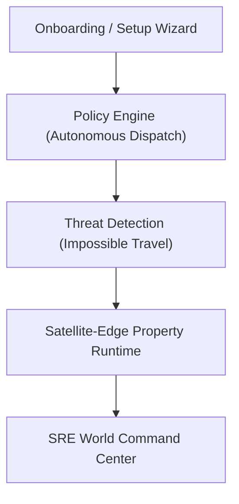

# SmartHotel OS — Enterprise Hospitality Platform
The Complete Hotel Management Solution with Autonomous Operations, Satellite-Edge Resilience, and Commercial Launch Stabilization.

---

## 🚀 Overview
SmartHotel OS is a production-stabilized, high-end hospitality platform engineered to scale seamlessly from boutique guest houses to multi-property resorts. The platform incorporates automated guest check-ins, AI housekeeping schedules, multi-currency VAT/GST ledgers, satellite-edge resilience runtimes, SRE threat analysis, and digital twin simulation engines.

---

## 🧱 Table of Contents
- [Features](#-features)
- [Enterprise & Autonomous Ecosystem](#-enterprise--autonomous-ecosystem)
- [Production Stabilization & Launch SRE](#-production-stabilization--launch-sre)
- [Tech Stack](#-tech-stack)
- [Project Structure](#-project-structure)
- [Installation & Quickstart](#-installation--quickstart)
- [SRE Verification & Operational Commands](#-sre-verification--operational-commands)
- [Testing & Quality Gates](#-testing--quality-gates)
- [License](#-license)

---

## ✨ Features

### 🏨 Hotel Management & Gating
- **Onboarding Wizard**: A simple, 10-minute automated portal to import rooms, configure property location, invite staff, and pre-seed luxury demo datasets.
- **Booking Engine**: Sophisticated check-in and checkout flows with double-booking prevention filters.
- **SaaS Pricing & Billing**: Starter ($29/mo), Professional ($89/mo), and Enterprise Lite ($249/mo) plans with middleware gating.

### 🍴 Interactive Guest Super App
- **Contactless QR Dining**: Guest room-specific menu selections, kitchen prepare-track dashboards, and billing.
- **Ambient Room Comforts**: Multilingual climate control, lightning adjustment panels, and simulated NFC digital key-card locks.

### 📊 OLAP Business Intelligence & BI
- **Executive Dashboards**: Tracking key operational indicators like occupancy ratios, RevPAR metrics, and payment commissions.
- **Unified Timeline Aggregator**: Sequential messaging hub collating guest communications (SMS, emails, WhatsApp) in real-time.

---

## 🛰️ Enterprise & Autonomous Ecosystem



*   **Autonomous Policy Engine**: Triggers automatic housekeeper allocations on guest checkout and issues loyalty offsets for delayed bookings.
*   **Security Threat Auditing**: Identifies anomalous access patterns, evaluates risk scores, and blocks compromised credential tokens.
*   **Satellite-Edge Resiliency**: Reroutes properties to local cached runtimes during satellite connectivity loss, replaying synchronized queues sequentially post-recovery.
*   **Global Command Center**: Provides SRE teams with real-time multi-region health maps, median latencies, and interactive failover triggers.

---

## 🛡️ Production Stabilization & Launch SRE
SmartHotel OS has completed its feature deployment cycle and is in a strict **Production Lockdown**. We prioritize simplicity, maintainability, performance, and SRE safety:
1.  **Strict Environment Valdiators**: Fast-failures triggered on missing Stripe, NextAuth, or clustered DB credentials.
2.  **Automated Daily Backups**: Integrated JSON compression dumps with 30-day retention policies.
3.  **Secure Header Directives**: Custom Content Security Policies (CSP) and secure HTTP-Only cookie directives.

---

## 🛠 Tech Stack

- **Frontend**: [Next.js 14](https://nextjs.org/) (App Router), [React 18](https://reactjs.org/), [Tailwind CSS](https://tailwindcss.com/), [Framer Motion](https://www.framer.com/motion/).
- **Backend/ORM**: Next.js API Routes, [Prisma ORM](https://www.prisma.io/).
- **Database/Cache**: [MongoDB](https://www.mongodb.com/) (Clustered Replica Sets), [Upstash Redis](https://upstash.com/).
- **Security & Logging**: [Sentry](https://sentry.io/), Custom Session Intrusion Auditors.
- **Integrations**: [Stripe](https://stripe.com/) (Billing), [Nodemailer](https://nodemailer.com/) (Mailing pipelines).
- **Testing**: [Jest](https://jestjs.io/), [Playwright](https://playwright.dev/), [k6](https://k6.io/).

---

## 📂 Project Structure

```text
app/                  # Next.js App Router (UI & API)
├── admin/            # SRE Command Center, Marketplace, Governance
├── onboarding/       # Operator Onboarding Setup Wizard
├── mobile/           # Guest Mobile Super App simulation page
├── api/              # Standard and Custom REST API endpoints
components/           # Reusable UI elements (Error boundaries, layouts)
docs/                 # Deployment guides, incident runbooks, security lists
lib/                  # Autonomous policies, edge satellites, threat filters
scripts/              # Automated database health and SRE verification runners
tests/                # Unit, integration, and E2E test suites
```

---

## ⚙️ Installation & Quickstart

### Prerequisites
*   Node.js (v18+)
*   MongoDB Atlas Account (Atlas Replica Set recommended)
*   Stripe Account

### Steps
1.  **Clone the repository:**
    ```bash
    git clone https://github.com/AsithaLKonara/Smart-Hotel-2.git
    cd Smart-Hotel-2
    ```

2.  **Install dependencies:**
    ```bash
    npm install
    ```

3.  **Set up Environment Secrets:**
    ```bash
    cp .env.example .env.local
    # Open .env.local and update Database and Stripe configurations
    ```

4.  **Execute Database Push:**
    ```bash
    npx prisma generate
    npm run db:push
    ```

5.  **Launch Local Server:**
    ```bash
    npm run dev
    ```
    Visit `http://localhost:3000` to interact with SmartHotel OS.

---

## 📡 SRE Verification & Operational Commands

Our core operation check suite audits database connections, replica sets, and backup integrity:

### Run Standalone Database Health Check
```bash
node scripts/db-health-check.js
```

### Run Disaster Recovery Backup Auditor
```bash
node scripts/backup-verify.js
```

### Run Unified Startup Check
```bash
node scripts/validate-env.js --production
```

---

## 🧪 Testing & Quality Gates
Every code merge is automatically subjected to rigorous quality gate sweeps before deployment promotion:

```bash
# Run Linting, Type-Check, and Jest Unit testing suites
npm run lint && npm run type-check && npm run test
```
*   **Unit Tests**: `npm run test:unit`
*   **Integration Tests**: `npm run test:integration`
*   **E2E Tests**: `npm run test:e2e`

---

## 📄 License
This project is licensed under the MIT License. See the `LICENSE` file for details.

---
Built with ❤️ for **SmartHotel OS** — Modernizing global hospitality operations.
