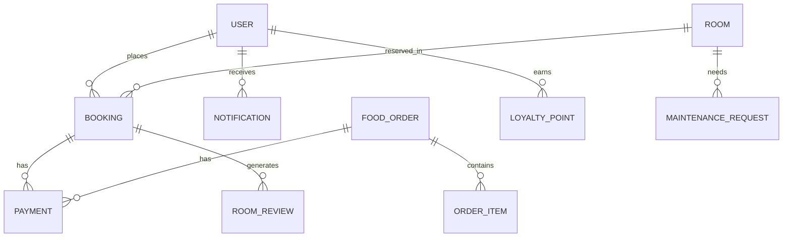

# SmartHotel OS — Next-Gen Hospitality Operating System

**The definitive, production-ready Hotel Management System (HMS) with Autonomous Operations, AI-Driven Guest Intelligence, and Satellite-Edge Resilience.**


---

## 💎 Project Philosophy: UI/UX & Aesthetics
SmartHotel OS is designed with a **"Digital First, Luxury Always"** philosophy. The interface is engineered to evoke the feeling of a premium concierge service.

### 🎨 Visual Language
*   **Design System**: Custom-built using **Tailwind CSS** with a focus on high-contrast readability and "glassmorphism" effects.
*   **Theming**: Dynamic **Dark/Light Mode** support via `next-themes`, defaulting to a sleek, professional dark aesthetic (`#0e0918`).
*   **Typography**: Optimized for clarity using **Inter** and **Outfit** (Google Fonts), providing a modern, geometric feel.
*   **Micro-interactions**: 
    *   **GSAP & Framer Motion**: Powering smooth page transitions, stagger animations for list items, and organic hover states.
    *   **Three.js**: Integrated for 3D room walkthroughs and interactive property maps.
*   **Responsive Engine**: Mobile-first architecture ensuring the Guest Super App feels native on iOS and Android.

---

## 🛠 Tech Stack (The "Engine Room")

### Core Frameworks
*   **Frontend**: [Next.js 14](https://nextjs.org/) (App Router, Server Components)
*   **Backend**: Next.js API Routes (Edge-ready)
*   **Runtime**: Node.js 18+

### Database & State
*   **Primary DB**: [MongoDB](https://www.mongodb.com/) (Document-based for high-velocity booking data)
*   **ORM**: [Prisma](https://www.prisma.io/) (Type-safe database access)
*   **Caching/Rate Limiting**: [Upstash Redis](https://upstash.com/) (Global low-latency data)
*   **State Management**: TanStack React Query (Server-state synchronization)

### Security & DevOps
*   **Auth**: [NextAuth.js](https://next-auth.js.org/) (JWT, RBAC, Google/Email Providers)
*   **Monitoring**: [Sentry](https://sentry.io/) (Real-time error tracking and performance profiling)
*   **Security**: Snyk (Vulnerability scanning), CSP (Content Security Policy) headers.
*   **Testing**: Jest (Unit), Playwright (E2E), Lighthouse (Performance).

---

## 👥 Roles & Access Control (RBAC)

| Role | Access Level | Responsibilities |
| :--- | :--- | :--- |
| **System Admin** | Full | Global settings, Property onboarding, Staff management, Financial audits. |
| **Receptionist** | Operational | Booking management, Check-in/out, Room assignments, Guest records. |
| **Kitchen Staff** | Task-based | Order queue management, Menu availability, Preparation tracking. |
| **Housekeeping** | Task-based | Room cleaning status, Maintenance reports, Inventory supply requests. |
| **Guest** | Self-Service | Self-check-in, Room control, QR dining, Loyalty tracking, Bill settlement. |

---

## ✨ Feature Modules

### 🏨 Core HMS
*   **Smart Booking Engine**: Multi-step flow with real-time availability, dynamic pricing, and double-booking protection.
*   **Room Management**: Visual floor plans, automated status updates (Clean, Dirty, Maintenance), and rich media galleries.
*   **Onboarding Wizard**: A 10-minute automated setup for property owners to configure rooms, taxes, and staff.

### 🍴 Guest Super App
*   **QR Dining**: Instant access to digital menus with real-time ordering and "Charge to Room" capabilities.
*   **Mobile Concierge**: Request towels, spa bookings, or local transport directly from a mobile browser.
*   **NFC Digital Keys**: Simulated NFC technology for mobile-based room entry.

### 🤖 AI & Autonomous Operations
*   **AI Dispatch Engine**: Automatically assigns housekeeping tasks based on check-out events and occupancy priority.
*   **Cognitive Chatbot**: Powered by **Groq & Upstash Redis Embeddings** for 24/7 guest support and hotel knowledge retrieval.
*   **Predictive Analytics**: Forecasting occupancy rates and RevPAR (Revenue Per Available Room).

### 📈 Business Intelligence
*   **Executive Dashboard**: Real-time charts (Recharts) for revenue, occupancy, and guest satisfaction.
*   **Audit Logs**: Complete traceability for every action taken by staff or guests.
*   **Financial Reports**: Exportable Excel/PDF ledgers for VAT/GST compliance.

---

## 🔗 External Integrations

### 🌍 Distribution & OTA
*   **OTA Sync**: Bidirectional connection with **Booking.com** and **Agoda** via middleware providers (**Channex / Beds24**). 
*   **Channel Manager**: Automatic inventory pushes and reservation pulls with price markup logic.

### 💳 Payments & Finance
*   **Stripe**: Secure payment intent processing, card vaulting, and automated webhook-based order fulfillment.

### ☁️ Infrastructure Services
*   **Cloudinary**: Automated image optimization and storage for room and gallery assets.
*   **Mailtrap/Nodemailer**: Transactional emails for booking confirmations and password resets.
*   **Google Maps API**: Property location visualization and nearby attraction routing.

---

## 🗄️ Database Schema Overview



### Key Models:
*   **Booking**: Tracks check-in/out, status (Confirmed, Cancelled), and total amount.
*   **Room**: Defines type, price, amenities, and floor.
*   **Inventory**: Manages hotel supplies (linens, toiletries) with minimum quantity alerts.
*   **Task**: Operational assignments for staff (Cleaning, Maintenance).
*   **Loyalty**: Points-based system with Bronze, Silver, Gold, and Platinum tiers.

---

## 🔐 Security & Resilience

1.  **Production Lockdown**: Strict environment validation at startup; the system fails fast if critical keys (Stripe, MongoDB) are missing.
2.  **SRE Governance**: Integrated audit logs for all administrative actions to prevent internal fraud.
3.  **Satellite-Edge Resilience**: Local caching strategies allow the property to operate during internet outages, synchronizing data once connectivity returns.
4.  **Privacy**: GDPR/CCPA ready with robust data isolation and encryption at rest.

---

## 🔑 Required Credentials

To run SmartHotel OS, you must configure the following in `.env.local`:

| Category | Key | Source |
| :--- | :--- | :--- |
| **Database** | `DATABASE_URL` | MongoDB Atlas Connection String |
| **Auth** | `NEXTAUTH_SECRET` | Run `openssl rand -base64 32` |
| **Payments** | `STRIPE_SECRET_KEY` | Stripe Dashboard (Test Mode) |
| **Payments** | `STRIPE_WEBHOOK_SECRET` | Stripe CLI (`stripe listen`) |
| **Media** | `CLOUDINARY_CLOUD_NAME` | Cloudinary Dashboard |
| **Email** | `SMTP_PASS` | Mailtrap.io SMTP settings |
| **AI** | `GROQ_API_KEY` | Groq Console (for Chatbot) |
| **Redis** | `UPSTASH_REDIS_URL` | Upstash Console |
| **Auth** | `GOOGLE_CLIENT_ID` | Google Cloud Console (OAuth) |
| **Maps** | `GOOGLE_MAPS_API_KEY` | Google Maps Platform |
| **Push** | `VAPID_PUBLIC_KEY` | Generate with `web-push` |
| **Realtime**| `SOCKET_IO_URL` | Application URL (for live chat) |

---

## 🚀 Status & Roadmap
*   **Status**: `v1.0.0-Stable` (Production Ready)
*   **Current Focus**: Hardening OTA sync resilience and expanding AI-driven revenue management.
*   **Upcoming**: Native iOS/Android apps, Multi-property "Global HQ" dashboard.

---

## ⚙️ Installation

1.  **Clone & Install**:
    ```bash
    git clone https://github.com/AsithaLKonara/Smart-Hotel-2.git
    npm install
    ```
2.  **Database Setup**:
    ```bash
    npx prisma generate
    npm run db:push
    npm run db:seed # Seed luxury demo data
    ```
3.  **Run Dev**:
    ```bash
    npm run dev
    ```

---

Built with ❤️ by the **SmartHotel OS Team**. Modernizing hospitality, one room at a time.
