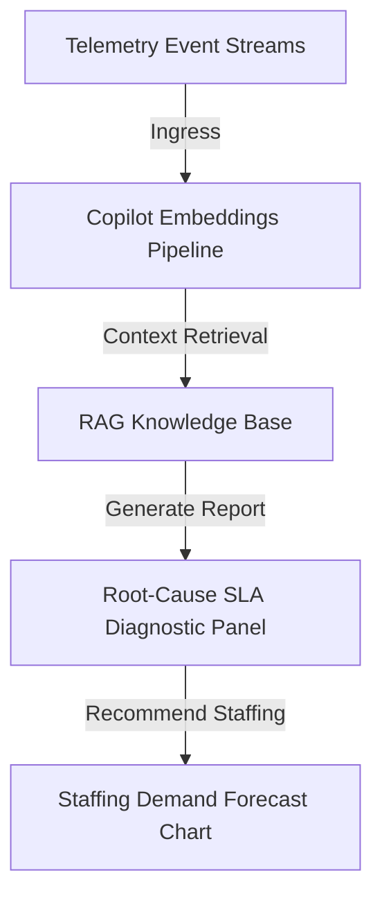

# SmartHotel OS — AI Operations Strategy

This document defines the integration of machine learning algorithms, natural language copilots, and forensic root-cause analyzers inside SmartHotel OS. It ensures administrative operators make fast, automated decisions during peak traffic conditions.

---

## 1. AI Operational Copilot Infrastructure

The AI Copilot does not operate as an isolated chat widget; rather, it functions as an **Embedded SRE Advisor** integrated into the Reception, Housekeeping, and Management consoles.

---

## 2. Root-Cause SLA Diagnostics Engine

When critical incidents or SLA breaches happen (e.g. *Water leak in Room 304 overflows AC condensation*), the AI Copilot performs an automated forensic triage review:

1. **Ingress Event History**: Traces chronological logs 120 minutes prior to the breach.
2. **Correlation Identification**: Identifies that room 304 was marked `MAINTENANCE_BLOCKED` 2 days ago, but released without supervisor check-approval.
3. **Forensic Report Output**:
   - *Breach Diagnostic*: "AC condenser leak in Room 304 is highly correlated with incomplete release check-approvals on May 6th."
   - *Actionable Solve*: "Block adjacent electrical panels and dispatch HVAC technician Marcus with compressor spare-parts instantly."

---

## 3. Dynamic Occupancy & Staffing Predictors

The predictive AI engine leverages sliding-window linear regression and historical seasonality matrices to forecast parameters 7 days in advance:

- **Demand Allocation Forecast**:
  $$\hat{D}_{t} = \alpha \times \text{Occupancy}_{t-1} + \beta \times \text{Seasonality}_{t} + \gamma \times \text{LocalEvents}_{t}$$
- **Automated Scheduling Recs**: If predicted occupancy $\hat{D}_{t} \ge 90\%$, the copilot recommends scheduling an additional $3$ Housekeeping shifts and prompts supervisors to pre-purchase standard minibar stocks.
