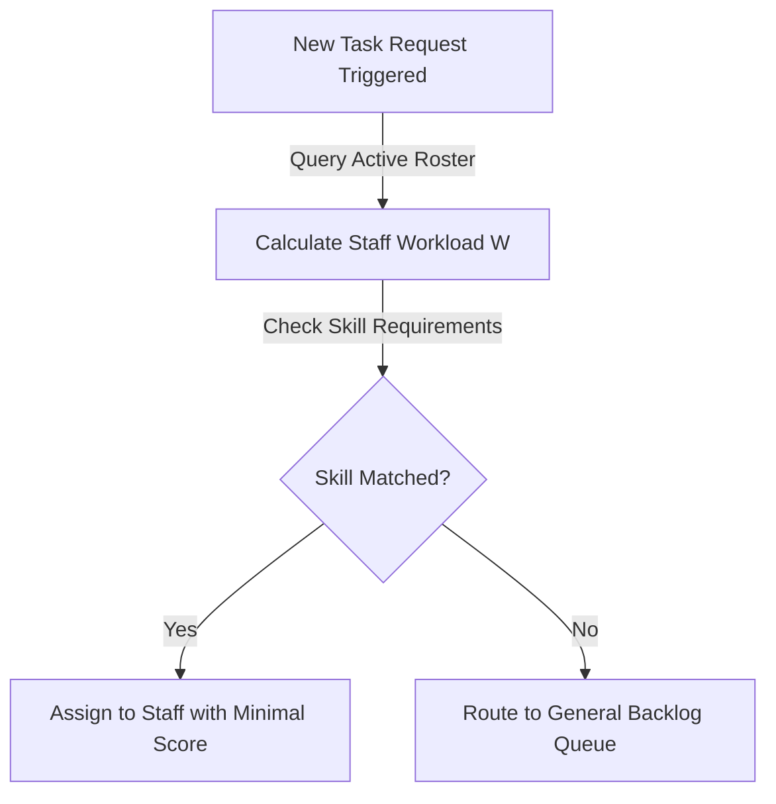

# SmartHotel OS — Smart Dispatch Engine Specification

This document defines the technical specifications, workload routing algorithms, and escalation workflows for the Smart Dispatch Engine in SmartHotel OS.

---

## 1. Workload-Aware Staff Assignment

To prevent cleaner or technician burnout, the engine distributes active dispatches using an **Equitable Load-Balancing Matrix**:

- **Active Workload (W)**:
  $$W = \sum \text{PendingTasks} + \text{CleaningComplexityFactor}$$
- **Routing Decision Formula**:
  $$\text{Target Staff} = \arg\min_{s \in \text{Roster}} \left( W_{s} \times \alpha + \text{ProximityFactor}_{s} \times \beta \right)$$

---

## 2. Skill-Based Staff Matching & Proximity Routing

Tasks require specific certifications (e.g. *HVAC maintenance requires electrical certification*):

- **Skill Certification Verification**: Before matching any maintenance or kitchen task, the system queries the staff's profile metadata array (`skills: ["hvac", "plumbing"]`).
- **Physical Proximity Matching**: Calculates distance indices based on floor layouts and active sector coordinates:
  $$\text{Proximity Score} = \left| \text{StaffFloor} - \text{TaskFloor} \right| \times \gamma$$

---

## 3. SLA-Aware Escalation Reassignments

If an assigned task is not acknowledged by staff within a predefined time interval, an automatic escalation workflow is triggered:

1. **Idle State Detection**: If a task remains `ASSIGNED` but not `IN_PROGRESS` past 50% of its target response SLA duration, the console triggers a warning ping.
2. **Auto-Reassignment Solve**: Past 100% SLA elapsed duration without acknowledgment, the task is revoked, marked `HIGH` priority, and reassigned to the nearest available worker with matching skills. The timeline records the audit log change.
