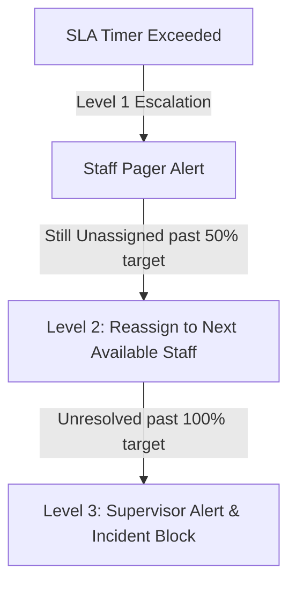

# SmartHotel OS — SLA Severity & Escalation Matrix

This document defines the formal Service Level Agreement (SLA) metrics, automated escalation loops, and department alerts configured inside SmartHotel OS.

---

## 1. Incident Severity Classification

All reported incidents and dispatches are routed automatically based on severity rankings:

| Severity Level | Reaction Target | Resolution Target | Target Department | Example Event |
| :--- | :--- | :--- | :--- | :--- |
| **EMERGENCY** | $<2$ Minutes | $<15$ Minutes | Maintenance / Manager | Burst water pipe, power failure. |
| **CRITICAL** | $<5$ Minutes | $<30$ Minutes | Kitchen / Front Desk | High KDS delays, payment failure. |
| **HIGH** | $<15$ Minutes| $<60$ Minutes | Housekeeping | Room clean lags for VIP check-in. |
| **MEDIUM** | $<30$ Minutes| $<120$ Minutes| Housekeeping / CMMS | Light bulb replacement. |
| **LOW** | $<60$ Minutes| $<240$ Minutes| Maintenance | Minor wall paint scuff. |

---

## 2. Automated Escalation Loops

If an incident transitions past its reaction SLA countdown without acknowledgment, the dispatch engine triggers an **escalation workflow**:

- **Escalation Reassignments**: High-severity incidents are dynamically reassigned to staff with matching skill matrices on adjacent floors to optimize response times.
- **SRE Audit Logs**: Timeline logs record the exact history of escalation events for post-incident review.
