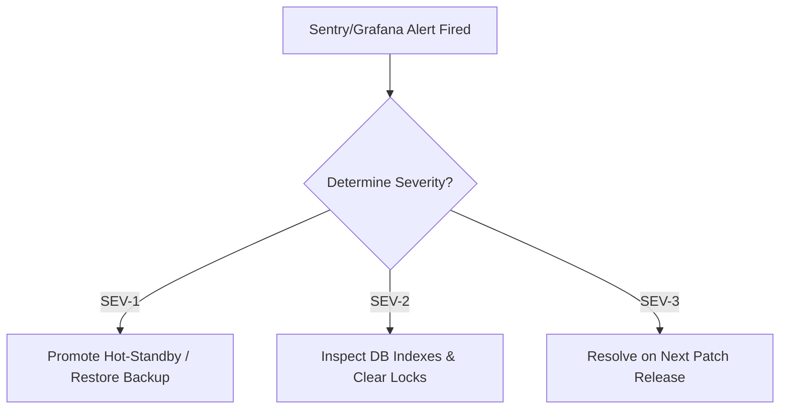

# SmartHotel OS — SRE Incident Response Runbook
**Document Version**: `1.0.0-ir`
**Status**: ACTIVE

This runbook defines standard incident levels, alert response patterns, diagnostics, and triage pathways for the SmartHotel OS operations platform.

---

## 🚨 1. Incident Severity Definitions

We categorize operational anomalies into three distinct severity parameters:

### SEV-1 — CRITICAL (Service Outage)
*   **Definition**: Booking capabilities completely offline, stripe transaction failures, or central database inaccessible.
*   **Response SLA**: Immediate response. Secondary hot standby nodes promoted.
*   **Action Paths**: Revert code commit, trigger SRE failover, or execute backup restores.

### SEV-2 — HIGH (Partial Degradation)
*   **Definition**: Delayed check-in dispatches, isolated websocket dropouts, or analytics report generation failures.
*   **Response SLA**: Under 2 hours.
*   **Action Paths**: Run database index optimizations, sweep websocket caches, or inspect background queues.

### SEV-3 — LOW (Minor Inconvenience)
*   **Definition**: Visual alignment anomalies, missing help translations, or micro-spacing discrepancies.
*   **Response SLA**: Next scheduled release candidate branch merge.

---

## 📈 2. Diagnostic Triaging Procedures

When an alert is fired from our Grafana generator alerts or Sentry dashboard:



### Triaging Commands:
1.  **Check Live Portals**: Open `/admin/platform-tools` to audit active transactional locks, queue lengths, and event outbox loops.
2.  **Audit DB Performance**: Connect to MongoDB shell and check index states:
    ```bash
    node scripts/db-health-check.ts
    ```
3.  **Inspect Environment**: Verify all environment variables are correctly mapped:
    ```bash
    node scripts/validate-env.js --production
    ```

---

## 🛡️ 3. Centralized Error Isolation
*   **ErrorBoundary**: Next.js client layout utilizes centralized React error boundaries (`components/error-boundary.tsx`) to isolate page breakdowns, ensuring a crash on an analytics graph doesn't prevent checking in guests.
*   **Sentry Logging**: Any unhandled server exception is automatically enriched with the tenant ID, client browser state, and route URL, then dispatched to Sentry for tracing.
