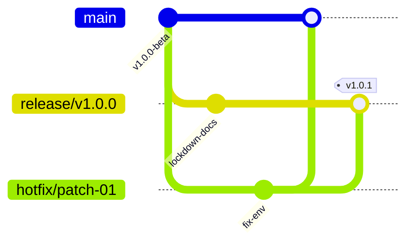

# SmartHotel OS — Production Lockdown & Code Freeze Manual
**Document Version**: `1.0.0-freeze`
**Status**: ACTIVE

This document outlines the strict production code freeze policy, git branching workflow, and release strategies required to maintain maximum operational stability and prevent regression across deployments.

---

## 🛑 1. Feature Freeze Policy
Effective immediately, the codebase is in **Feature Freeze**. 
*   **Zero-Feature Policy**: No new features, AI modeling integrations, multi-region partitions, or UI pages are permitted.
*   **Permitted Code Edits**: The only commits allowed are:
    1.  Critical bug fixes (resolving logged issues or crash reports).
    2.  Security vulnerabilities (CVE mitigations).
    3.  Environment schema adjustments required for cloud provisioning.
    4.  Visual/accessibility alignments ensuring compliance.

---

## 🌿 2. Branching and Release Strategy
To preserve the reliability of our main product branches, we adhere to the following branch topology:



### Branches:
1.  `main`: Active codebase. All bugfixes must be developed on separate branches and merged to `main` via reviewed Pull Requests.
2.  `release/vX.Y`: Dedicated production branch. Commits here represent frozen launchcandidates.
3.  `hotfix/*`: Transient branches spawned off the release branch to address high-priority production patches.

---

## ⏪ 3. Rollback Procedures
If a live deployment results in database degradation or elevated error rates, SRE teams must initiate an **Automated Rollback**:

### Code Rollback
1.  **Vercel / Cloud Provider**: Revert to the previously known-good build SHA in the deployment dashboard.
2.  **Git Revert**: Execute git revert on the problematic commit and push immediately to trigger automated build rebuilds:
    ```bash
    git revert <failed_commit_sha>
    git push origin main
    ```

### Database Rollback
If a Prisma schema change caused data corruption:
1.  Bring the hot standby secondary online.
2.  Restore the midnight database backup using the `backup-verify.ts` auditing framework.

---

## 🛠️ 4. Hotfix Process
When a high-priority bug occurs:
1.  Spawn a `hotfix/fix-name` branch from `release/vX.Y`.
2.  Develop and test the fix locally.
3.  Execute local verification suites:
    ```bash
    npm run lint && npm run type-check
    ```
4.  Merge into `release/vX.Y` and tag with semantic versioning:
    ```bash
    git tag -a v1.0.1 -m "Hotfix: Mitigate production outbox lock delay"
    git push origin v1.0.1
    ```

---

## 🏷️ 5. Semantic Versioning Rules
We follow strict [SemVer 2.0.0](https://semver.org/) rules:
*   `MAJOR` (X.0.0): Significant breaking migrations.
*   `MINOR` (0.Y.0): Backwards-compatible optimizations or enhancements.
*   `PATCH` (0.0.Z): Low-risk backwards-compatible security patches or bugfixes.

---

## 📋 6. Deployment Approval Checklist
Before any code can be promoted to staging or production:
- [x] Zero TypeScript compilation errors (`npm run type-check` exits 0).
- [x] Zero static lint issues (`npm run lint` exits 0).
- [x] Pre-prod smoke tests pass cleanly (`scripts/production-smoke-test.ts` exits 0).
- [x] Backup verify scripts run successfully.
- [x] SRE/Principal Architect approval obtained.
