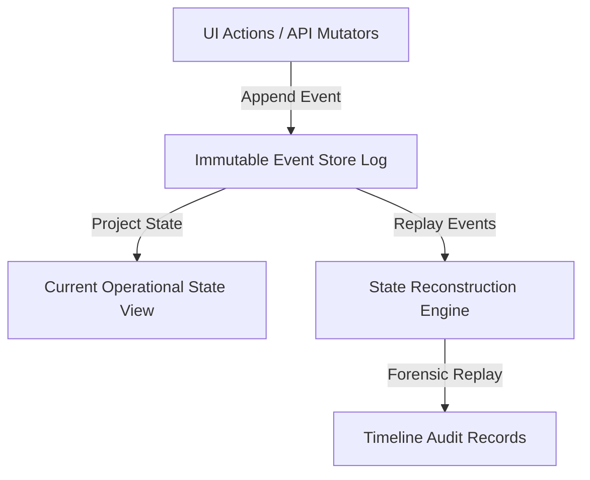

# SmartHotel OS — Event Stream Governance & Event Sourcing Specification

This document details the immutable, append-only event-sourcing architectural standards that drive state tracking, forensic auditing, and timeline reconstruction in SmartHotel OS.

---

## 1. Event-Sourced Architecture (Immutable Journaling)

Rather than storing mutable status rows directly, SmartHotel OS tracks room and operational state transitions through an **Append-Only Event Store Journal**:



- **Core Event Interface**:
  ```typescript
  interface SourcedEvent {
    id: string;
    aggregateId: string; // e.g. "room-204"
    aggregateType: "ROOM" | "BOOKING" | "INCIDENT";
    sequence: number;
    eventType: "STATUS_CHANGED" | "AMENITY_CHANGED" | "INCIDENT_FILED";
    payload: any;
    actor: string;
    timestamp: string;
  }
  ```

---

## 2. Dynamic State Reconstruction & Replays

The current operational state of any room or booking is derived dynamically by projecting historical events from sequence $0$ to sequence $N$:

$$\text{Current State } S_N = \sum_{i=1}^{N} f\left(S_{i-1}, \text{Event}_i\right)$$

### Reconstruction Use Cases:
- **Timeline Regeneration**: Let supervisors query: *"What exact room and staff coordinates existed yesterday at 3:15 PM?"*
- **Forensic Auditing**: Replays event sequences to verify status change timings when evaluating staff performance or guest complaints.
- **System Disaster Recoveries**: If database nodes experience corruption, the State Reconstruction Engine replays historical append-only journals from the latest snapshot, restoring state views without losing transactions.
