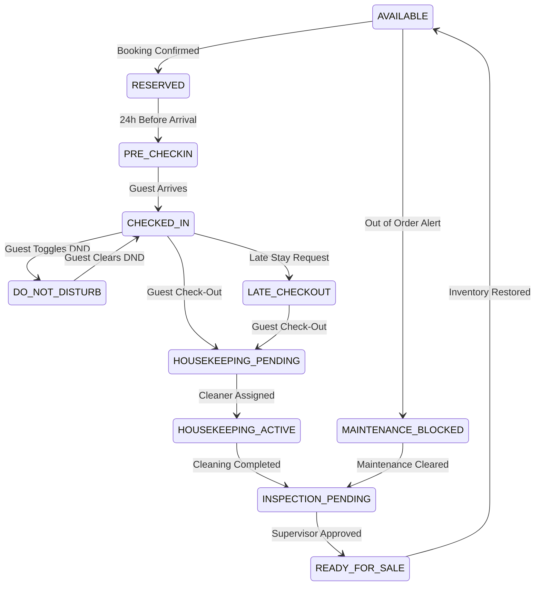

# SmartHotel OS — Operational Architecture Specification

This document defines the Next-Gen operational architecture, database state machine schemas, and event stream mappings that drive SmartHotel OS.

---

## 1. Unified Room Lifecycle State Machine

SmartHotel OS tracks guest room states using a finite state machine (FSM) containing **14 distinct operational states**:

### Transition Verifications:
To prevent staff allocation errors, transitions must pass static adjacency check lists. For example:
- A room cannot transition from `HOUSEKEEPING_PENDING` straight to `AVAILABLE` without passing `INSPECTION_PENDING` check-approval.
- A room tagged `DO_NOT_DISTURB` blocks housekeeping assignments automatically.

---

## 2. Shared In-Memory State Synchronizer

Connected client browsers (Reception, Kitchen, Housekeeping, Maintenance, Managers) are synchronized in real-time via persistent WebSockets:

- **State Event Bus**: Core state alterations emit payload structures onto the in-memory `lib/event-bus.ts` stream.
- **Deduplication Sliding Window**: High-frequency telemetry updates (e.g., repeating temperature sensors) are filtered within a 2500ms sliding window to protect users from sensory overload.
- **Offline Caching**: Housekeeper mobile devices cache offline actions in LocalStorage, replaying queue requests on reconnection.
