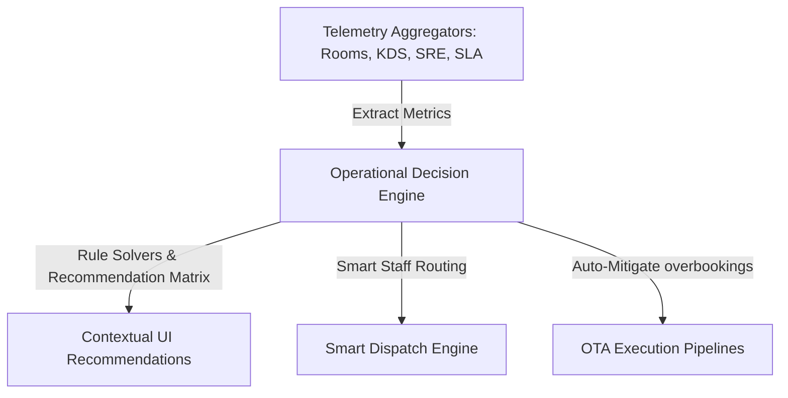

# SmartHotel OS — Operational Intelligence Architecture Specification

This document defines the Next-Generation Operational Intelligence layer of SmartHotel OS. It details how the platform transforms telemetry event streams into real-time recommendations, smart staff dispatching, and SRE failover structures.

---

## 1. Intelligence System Topology

The platform integrates multi-department data matrices into a singular, highly cohesive **Decision-Making Infrastructure**:

---

## 2. Recommendation Generator Pipeline & Weights

The decision solver dynamically classifies recommendations by calculated priority index weight formulas:

$$\text{Priority Score (P)} = \text{Severity Weight} \times 0.40 + \text{Urgency Factor} \times 0.60$$

### Decision Trigger Formulas:
1. **Cleaning Turnaround Risk**: Triggered if vacant available status drops below critical buffer indices ($<5\%$). Dispatches emergency housekeeper sweep notifications.
2. **Double-Booking Mitigation**: Triggered on OTA conflict ingestion. Instantly applies quarantine isolates, freezes overlapping channel pools, and triggers up-category upgrades.
3. **KDS Queue Pressure**: When food tickets delay triggers high-SLA counts, reception console triggers compensatory vouchers (*"Offer complimentary welcome drinks"*).

---

## 3. Multi-Property Federation Foundations

SmartHotel OS supports federated hotel operations mapping distinct assets through tenant-aware database schemas:

- **Centralized SRE Control Tower**: Aggregates telemetry across multiple geographical physical properties (`propertyId` fields in databases).
- **Cross-Property Dispatch**: Permits supervisors to dynamically shift cleaning or maintenance crew lists from low-occupancy assets to peak-occupancy sites.
- **Shared Inventory Pools**: Coordinates local buffers dynamically, reducing overbooking parameters across neighboring hotels during regional occupancy spikes.
