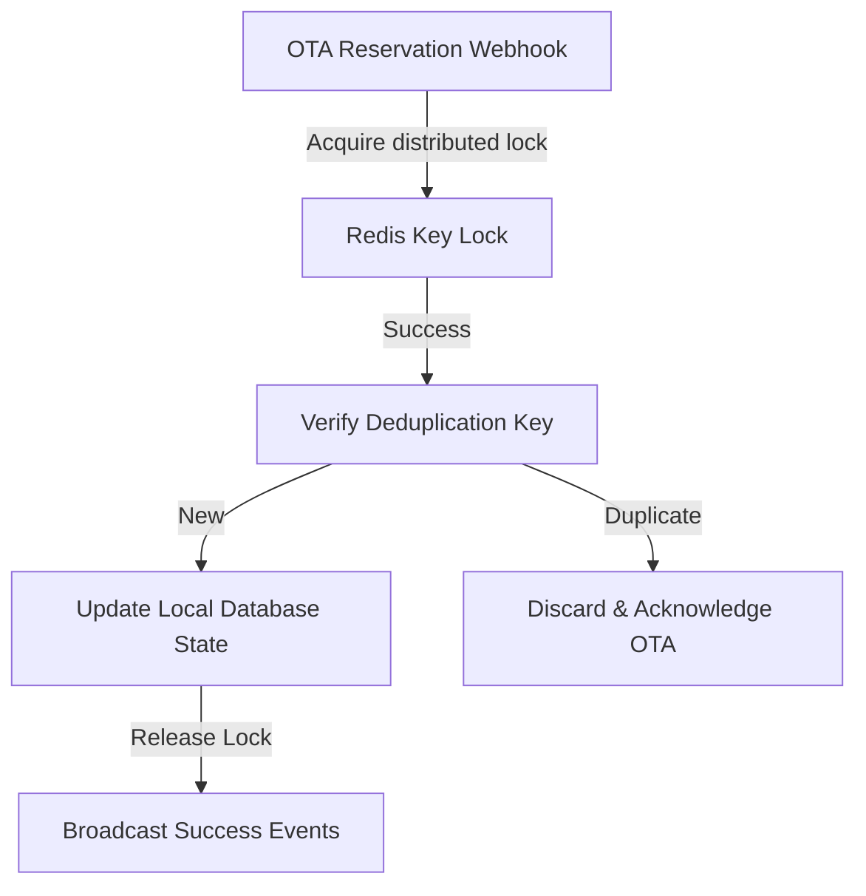

# SmartHotel OS — OTA Execution Architecture

This document defines the production-grade, real-time integration execution pipelines between SmartHotel OS and Online Travel Agencies (OTAs).

---

## 1. Webhook Ingestion & In-Memory Locks

Incoming reservation webhooks must navigate an asynchronous processing queue to prevent database locks:

- **Distributed Locks**: Employs redis-based distributed locks keyed by room and date ranges (`lock:room_id:date_range`) during inventory checks.
- **Deduplication Filter**: Discards duplicate payloads by verifying the channel reference ID within a 10-minute sliding window.

---

## 2. Ingress Retry Workers & Sync Failures

Outgoing transactions to OTAs (e.g. *Updating Room Rates on Booking.com*) that fail are routed to a persistent background retry queue:

- **Dead-Letter Queue (DLQ)**: If a transaction fails after 5 sequential retry rounds (using exponential backoff), the payload is quarantined in the DLQ.
- **Escalation Notification**: DLQ ingress triggers a high-severity incident inside the SRE control console.

---

## 3. Real-Time Channel Health Scoring

The system evaluates the performance of active channel integration connections:

- **Health Formula**:
  $$\text{Sync Health Score} = 100 - \left( \text{FailedSyncs Ratio} \times 40 + \text{AvgLatency(ms)} \times 0.05 \right)$$
- **Score Guidelines**:
  - **90 - 100**: OPTIMAL status (Emerald green display).
  - **70 - 89**: DEGRADED status (Amber yellow display; raises automatic diagnostics).
  - **< 70**: CRITICAL status (Pulsing ruby red display; locks further inventory modifications).
