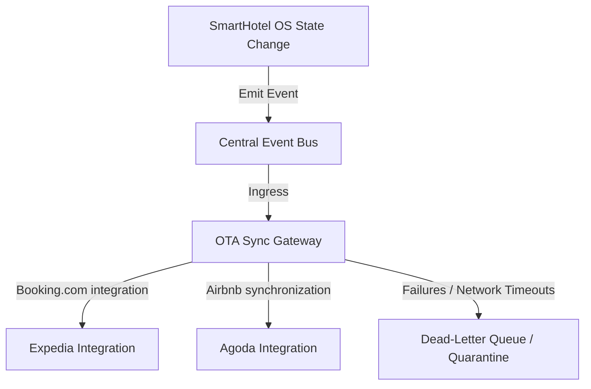

# SmartHotel OS — OTA Synchronization Strategy & Channel Integrations

This document defines the production-grade, real-time integration execution pipelines between SmartHotel OS and Online Travel Agencies (OTAs).

---

## 1. Multi-Channel Synchronization Topology

SmartHotel OS leverages an event-driven, CQRS-compatible **OTA Channel Management Core** integrating Booking.com, Expedia, Airbnb, and Agoda:

---

## 2. Ingress Retry Workers & Sync Failures

To guarantee event delivery under flaky networking conditions:

- **Idempotent Webhook Processors**: Ingress payloads require unique idempotency keys (`Idempotency-Key` headers) containing hashing hashes of transaction attributes.
- **Retry Queues (Exponential Backoff)**: Failed API updates trigger automated scheduling retries following logarithmic backoff sequences:
  $$\text{Backoff Duration (ms)} = \text{BaseInterval} \times 2^{\text{AttemptCount}}$$
- **Quarantine Handling**: Payloads that fail all $5$ retry sequence thresholds are isolated within SRE quarantine repositories for supervisor forensic analysis.

---

## 3. Real-Time Availability Consistency Metrics

To eliminate double-bookings completely across channels, state changes acquire distributed Redis leases (`inventory_lock:room_id:date_range`) prior to mutating database records:

- **Inventory Drift Detection**: A background reconciliation routine runs every 10 minutes to verify availability parity values between external OTA APIs and the SmartHotel local database.
- **Drift Auto-Resolution**: When discrepancy is detected, the local PMS engine dominates (first-in-wins rule) and automatically overrides and updates the OTA parameters.
